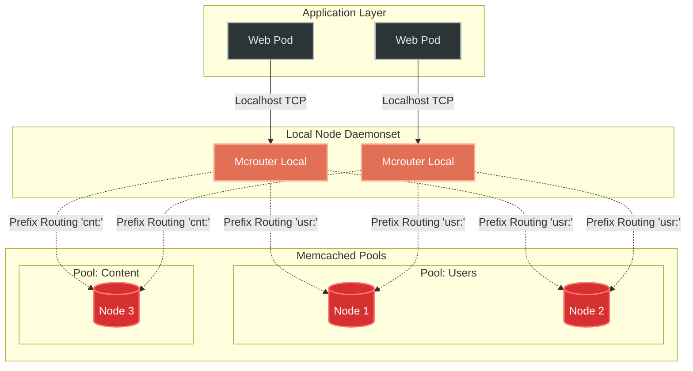

# Hands-On Examples: Memcached

## Scenario 1: Mitigating the Cache Stampede (Thundering Herd)

A Cache Stampede occurs when an intensely accessed key (e.g., the homepage data for a major news site) suddenly expires. Because thousands of web requests hit the cache simultaneously over the next millisecond, they all register a "cache miss". All 10,000 threads immediately query the backend PostgreSQL database to regenerate the data, causing instant database CPU exhaustion and downtime.

### ❌ Before (Anti-Pattern)
A standard read-through cache pattern with hard TTLs.
```python
def get_homepage_data():
    # Attempt to read from Memcached
    data = mc.get("homepage_v1")
    if data is not None:
        return data  # < 1ms
        
    # DEADLY CACHE MISS
    # If 10,000 requests reach here simultaneously, 
    # the database receives 10,000 identical heavy queries.
    data = db.query("SELECT * FROM heavy_aggregations WHERE...") # 800ms
    
    # Store with hard 5-minute expiration
    mc.set("homepage_v1", data, time=300)
    return data
```
**Result:** Every 5 minutes, database CPU spikes to 100%. If the database takes longer than standard timeouts to recover, the site completely drops offline.

### ✅ After (Correct Approach: Probabilistic Early Expiration - XFetch)
Instead of waiting for the key to truly vanish, the application artificially generates cache misses *probabilistically* before the key actually expires. Only one thread gets "unlucky" and rebuilds the cache in the background while others continue serving slightly stale data.

```python
import time
import random

def get_homepage_data_xfetch():
    # We store a tuple of (data, actual_creation_time), with a longer Memcached TTL
    cache_record = mc.get("homepage_v1")
    
    now = time.time()
    beta = 1.0     # Tunable aggressiveness
    delta = 0.8    # Baseline computation time (800ms)
    ttl = 300      # Desired logical TTL (5 mins)
    
    if cache_record is not None:
        data, created_at = cache_record
        expiry_time = created_at + ttl
        
        # PROBABILISTIC EARLY EXPIRATION ALGORITHM
        # -random.log(random.random()) generates exponentially distributed randoms.
        # As 'now' approaches 'expiry_time', the chance of returning True skyrockets.
        should_recompute = (now - delta * beta * (-math.log(random.random()))) > expiry_time
        
        if not should_recompute:
            return data # 99.99% of requests get fast stale data while 1 thread computes
            
    # Compute the data (either we have True Cache Miss, or we are the unlucky Early Expiration thread)
    data = db.query("SELECT * FROM heavy_aggregations WHERE...")
    
    # Store for 2x TTL to ensure it physically exists while early computation happens
    mc.set("homepage_v1", (data, now), time=ttl * 2) 
    return data
```
**Result:** Zero database spikes. Throughput remains a smooth **50,000 req/sec**. P99 latency stays identical across TTL boundaries.

---

## Scenario 2: High Contention Counters with CAS

### ❌ Before (Anti-Pattern)
Attempting to build a distributed limit counter using simplistic get/set loops.
```python
# Thread A gets 99, Thread B gets 99
current = int(mc.get("api_limit_user_104") or 0)
new_count = current + 1
# Both set to 100, effectively dropping a request!
mc.set("api_limit_user_104", new_count)
```

### ✅ After (Correct Approach)
Using atomic Memcached specific `incr` or the `CAS` loop.
```python
# OPTION 1: Utilize native C-level atomicity
# incr(key, amount, default_if_missing)
mc.incr("api_limit_user_104", 1, 1)

# OPTION 2: Using CAS for complex mutations (e.g. appending JSON status)
def append_history(user_id, action_log):
    while True:
        # gets returns the Value AND the opaque CAS token
        val, cas = mc.gets(f"history_{user_id}")
        
        if val is None:
            # First write, standard set is okay
            mc.set(f"history_{user_id}", [action_log])
            break
            
        val.append(action_log)
        
        # cas fails and returns False if ANY other thread modified the key 
        # since we pulled the CAS token
        if mc.cas(f"history_{user_id}", val, cas):
            break 
            
        # Collision detected! Loop restarts to get fresh data and token
```

---

## Integration Diagram: Mcrouter at Scale

When connecting 5,000 API pods to 500 Memcached servers, TCP connections explode ($5,000 \times 500 = 2,500,000$ connections). Facebook built `mcrouter` to solve this geometry.


**Mechanism:** `mcrouter` reads the key prefix (e.g., `usr:1004`). It applies consistent hashing and connection pooling. App pods only ever open **1 TCP connection** (to the local `mcrouter`), and `mcrouter` maintains the persistent socket pools to the caching farm.
