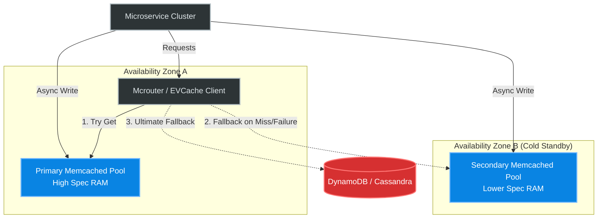

# Real-World Scenarios: Memcached

## 01: Facebook (Meta) — The Origin of Massive Scale Caching
- **Scale**: The largest Memcached deployment on earth. Processing **billions of requests per second** across tens of thousands of cache nodes globally.
- **Architecture Decision**: Facebook's PHP frontend architecture dictates that assembling a user profile requires hundreds of parallel data fetches. Performing this against MySQL was impossible. Facebook implemented a "Lookaside" architecture, relying heavily on UDP for `get` requests (to avoid TCP handshake overhead on tiny latency budgets) and TCP for `set`/`delete` operations.
- **Key Innovation (Mcrouter)**: As the cluster grew, Facebook experienced "Incast Congestion"—a scenario where 100 cache nodes respond to 1 web server simultaneously, overflowing the top-of-rack switch buffers and causing massive packet drops. Facebook developed **mcrouter** to aggregate, batch, and prefix-route these requests, shaping the traffic at the network edge to prevent switch buffer exhaustion.
- **Production Numbers**: Memcached responds to UDP get requests in **<300 microseconds** inside Facebook's datacenters.

## 02: Netflix — Memcached vs Redis for Viewing History
- **Scale**: Trillions of personalized viewing history and recommendation tokens globally.
- **Architecture Decision (EVCache)**: Netflix built EVCache as a distributed key-value store wrapping Memcached. They chose Memcached over Redis for this specific tier because Memcached’s multi-threaded core allowed a single AWS EC2 instance to push **1-2 million ops/sec**, whereas a single Redis core maxed out much earlier requiring more VMs.
- **Implementation**: EVCache handles multi-region replication. If a user in the US watches a show, the viewing token is written to the US East Memcached pool. EVCache asynchronously replicates that key payload to the EU-West Memcached pool via Apache Kafka.
- **Trade-Off**: Because Memcached has no persistence, if an entire AWS availability zone fails, Netflix boots a new zone with empty Memcached nodes. To combat this "Cold Cache Misfire," EVCache dynamically forces read routes to fallback to secondary cache zones rather than hitting massive Cassandra backend clusters directly.

## 03: Post-Mortem: The Memcached Amplification DDoS Attack (2018)
- **Incident**: GitHub was hit with the largest DDoS attack recorded at the time, generating **1.35 Tbps (Terabits per second)** of incoming traffic, knocking the site offline.
- **Root Cause**: The attack was a **Memcached Amplification Attack**. Thousands of organizations had mistakenly left Memcached bound to the public internet (`0.0.0.0`) on default port 11211. Memcached (by design) allowed UDP connections with zero authentication. Attackers sent a tiny UDP request (IP spoofed to look like it came from GitHub) asking Memcached to return a massive 1MB value. Memcached dutifully sent the 1MB payload to GitHub. The amplification factor was **51,000x**.
- **Fix**: The global engineering community rapidly deployed patches to Memcached to disable UDP by default in modern distributions. GitHub implemented Akamai Prolexic to scrub the incoming UDP flood.
- **Prevention**: In infrastructure-as-code (Terraform/Ansible), it is now explicitly mandated to bind Memcached exclusively to internal loopback interfaces or private subnets (`-l 10.0.1.5` or `127.0.0.1`), and security groups strictly drop inbound UDP port 11211.

## Deployment Topology
Modern global Memcached caching tiers utilize secondary clusters for "Cold Zone" fast-failover, preventing the backend database from being destroyed if the primary cache goes down.

