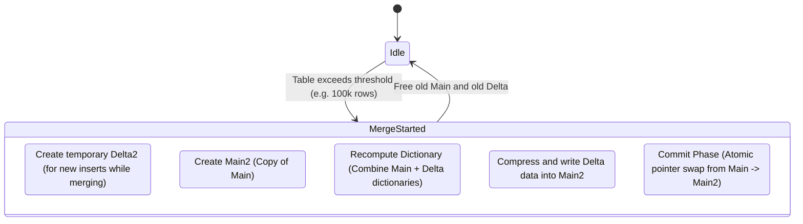
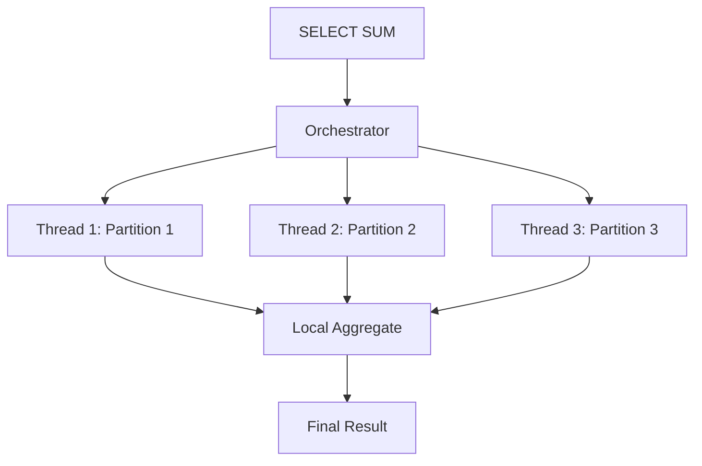

# How It Works: SAP HANA Internals

To achieve true HTAP (Hybrid Transactional and Analytical Processing), SAP HANA must solve a fundamental computer science paradox:
- **OLTP (Transactions)** requires single-row locks, quick appends, and horizontal data reading (give me the whole user profile). **Row Stores** are optimal here.
- **OLAP (Analytics)** requires sequential vertical reading (sum all revenues across all users) and extreme compression. **Column Stores** are optimal here.

HANA runs both concurrently in the same memory space, relying on the **Delta Merge** architecture to bridge the gap.

## 1. The Store Mechanisms
When creating a table in HANA, the DBA explicitly specifies `CREATE COLUMN TABLE` or `CREATE ROW TABLE`.
- **Row Tables** are rarely used (maybe 5% of memory). Reserved for tiny configuration tables or sequencing tables that change wildly but are never aggregated.
- **Column Tables** house everything else. Even transactional tables (like `VBAK` Sales Orders) are built as Column Stores.

### The Problem with Column Storage
If you have a billion-row column table and you `INSERT` one new sales order, appending 50 columns to 50 fundamentally distinct memory arrays physically destroys cache lines and requires locking massively compressed blocks. The `INSERT` would take 5 seconds. This is unacceptable for an ERP system.

## 2. The Solution: L1, L2, and Main Store (The Delta Merge)

HANA bridges the OLTP/OLAP divide by splitting every single Column Table into three hidden memory structures.

```mermaid
graph TD
    classDef main fill:#0984e3,stroke:#74b9ff,stroke-width:2px,color:#fff;
    classDef l1 fill:#d63031,stroke:#ff7675,stroke-width:2px,color:#fff;
    classDef l2 fill:#e17055,stroke:#fab1a0,stroke-width:2px,color:#fff;
    classDef merge fill:#00b894,stroke:#55efc4,stroke-width:2px,color:#000;

    subgraph "Incoming Transactional Write"
        INSERT[INSERT INTO Sales_Order]:::l1
    end
    
    subgraph "Memory Structures for 1 Column Table"
        L1[L1 Delta \n(Row-based, Append-only, Uncompressed)]:::l1
        L2[L2 Delta \n(Column-based, Uncompressed, Dictionary)]:::l2
        Main[Main Store \n(Column-based, Max Compression, Bit-packed)]:::main
    end
    
    INSERT -->|Lock-free Append| L1
    
    L1 -->|Async L1-to-L2 Merge \n(every 10k rows)| L2
    
    L2 -->|DELTA MERGE \n(Heavy background process)| Main
    
    subgraph "Analytical Read Query"
        SELECT[SELECT SUM(Revenue)]:::merge
    end
    
    SELECT -.->|Read & Combine| L1
    SELECT -.->|Read & Combine| L2
    SELECT -.->|Read & Combine| Main
```

### The Read/Write Path
1. **Write**: The `INSERT` goes straight into the **L1 Delta**, an uncompressed Row Store in RAM. It takes microseconds. Fast OLTP transaction complete.
2. **Read**: A BI analyst runs `SUM(Revenue)`. The HANA SQL Engine scans the massive compressed Main Store, the L2 Delta, and the tiny L1 Delta, combining the results in memory. Because L1 is so small (never allowed to grow past a few megabytes), the un-optimized scan takes minimal time.

## 3. The Delta Merge Process (Byte Level)
The Delta Merge is the most CPU and memory-intensive operation in HANA. 


*Note: During Step 5, memory utilization can spike dramatically because Main and Main2 exist in RAM simultaneously.*

## 4. Dictionary Encoding & Bit Packing

HANA achieves its 3x-10x compression natively across all columns via two-step compression. Let's look at the `COUNTRY` column.

**Step A: Dictionary Encoding**
Instead of storing strings linearly, HANA assigns an integer ID.
```text
Dictionary Array:
[0]: "BRAZIL"
[1]: "CANADA"
[2]: "USA"

Value Vector:
Row 0: 2 (USA)
Row 1: 0 (BRAZIL)
Row 2: 2 (USA)
Row 3: 1 (CANADA)
```

**Step B: Bit Packing (N-Bit encoding)**
If the `COUNTRY` dictionary only has 3 distinct values (0, 1, and 2), you don't need a 32-bit integer or an 8-bit char. You only need **2 bits** of physical memory (`00`, `01`, `10`) to represent every row!

```c
// Conceptually, HANA packs these bits together in CPU cache lines
0b_10_00_10_01  // Represents Rows 0-3 (USA, BRAZIL, USA, CANADA) physically taking exactly 1 Byte of RAM!
```

## 5. Persistence (How RAM survives a crash)

In-memory doesn't mean volatile. HANA is strictly durable (ACID).

1. **Redo Log (Sync)**: When an `UPDATE` commits, it is written immediately to a Log Buffer, which `fsync`s to the SSD log volume. The transaction is not confirmed to the user until the disk acknowledges the write.
2. **Savepoint (Async)**: Every 5 minutes, HANA takes a complete physical "picture" of all RAM pages that have changed and writes them sequentially to the Data Volumes on disk. 
3. **Crash Recovery**: Server loses power. On boot, HANA loads the last 5-minute Data Volume Savepoint into RAM (takes seconds/minutes). It then replays the Redo Logs strictly for the exact micro-transactions that occurred after that 5-minute mark. Data loss = ZERO.

## 6. The Execution Engine: Vectored Processing

Traditional databases process data "Tuple-at-a-Time" (iterator pattern). This is slow due to high function call overhead. HANA uses **Vectored Execution** (SIMD - Single Instruction, Multiple Data).

```mermaid
graph LR
    subgraph "Tuple-at-a-Time (Slow)"
        T1[Row 1] --> Proc1[Function Call]
        T2[Row 2] --> Proc2[Function Call]
    end

    subgraph "Vectored Execution (HANA)"
        V[Block of 1000 IDs] --> SIMD[One CPU Instruction]
        SIMD --> R[1000 Results]
    end
    
    note over SIMD: Leverages Intel AVX-512\nregisters to process\nentire arrays in 1 clock cycle.
```

## 7. Parallel Query Processing

HANA is designed for massive multi-core servers (e.g., 224 cores). It parallelizes a single query across multiple threads.


