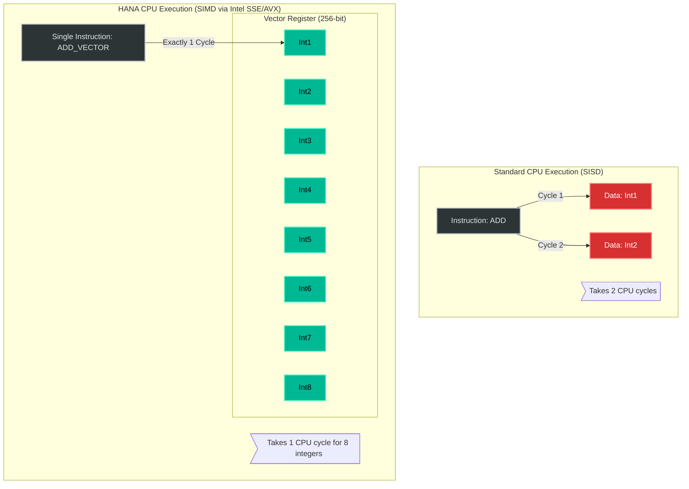

# Interview Angle: SAP HANA

## Q1: "How does an In-Memory Column Store handle fast transactional inserts? Isn't it incredibly slow to append to a column store?"

### What They Are Really Testing
Do you fundamentally understand the architecture of modern HTAP (Hybrid Transactional and Analytical Processing) databases? Do you know the difference between a read-optimized and write-optimized data structure?

### Senior Engineer Answer
"Column stores are terrible for fast row-based inserts because adding one row requires locking and updating 50 separate column structures. To solve this, HANA doesn't write directly to the Column Store. It writes to a hidden L1 Delta Store, which is actually an uncompressed row store. Later, a background process merges this delta store into the massive compressed Main column store."

### Principal Architect Answer
"HANA bridges the OLTP/OLAP divide by decomposing table architecture into three distinct stages: L1 Delta, L2 Delta, and Main Store.
1. The **L1 Delta** is a pure write-optimized row-store in RAM. Inserts happen here in microseconds, maintaining tight SLI transactional latency.
2. The **L2 Delta** is a fast-converted uncompressed column store.
3. The **Main Store** relies on massive dictionary encoding and bit-packing.
The magic happens during read. When a user runs a massive `SELECT SUM(x)`, the query execution engine natively scans and concatenates the results from the highly compressed Main Store and the volatile Delta Stores simultaneously in memory. The DBA only has to manage the **Delta Merge** background CPU footprint to ensure the volatile structures don't grow too large."

### Follow-Up Probe
*Interviewer: "What is the primary risk during that Delta Merge process?"*
**Answer**: "A massive memory spike. During the final commit swap of the Delta Merge, HANA must hold the original Main Store array and the newly constructed Main2 Store array in memory simultaneously. If your table is 500GB, you need over 1TB of free RAM during the merge. If you span that threshold, the OOM Killer crashes the node."

---

## Q2: "How does HANA compress data so effectively that a 10TB Oracle DB shrinks to 2TB?"

### What They Are Really Testing
Do you understand Dictionary Encoding, integer bit-packing, and how physical data cardinality impacts extreme database scaling?

### Senior Engineer Answer
"HANA uses an internal dictionary algorithm. It scans the column, records unique values once in a dictionary table, and then populates the actual main table with tiny integer pointers pointing to that dictionary value."

### Principal Architect Answer
"It uses a two-phase compression heavily dependent on **data cardinality**.  
First, **Dictionary Encoding**: The string 'Munich' is stored exactly once in a column dictionary and assigned an integer ID, say `14`. 
Second, and most importantly, **Bit-Packing (N-Bit Encoding)**: If there are only 4 distinct values total in the entire column dictionary across 10 million rows, HANA doesn't use a 32-bit integer for the pointers. It recognizes that 4 values can be fundamentally represented using exactly **2 bits** of physical memory (`00`, `01`, `10`, `11`). It bit-packs these tiny addresses together densely into CPU cache lines. This is why a huge column of low-cardinality data shrinks to almost zero physical footprint, reducing memory bandwidth usage during vector aggregations."

---

## Whiteboard Exercise: The Concept of SIMD in In-Memory DBs

**Prompt:** Explain why SAP HANA can sum 1 billion integers significantly faster than a standard single-threaded C `for` loop, even if both are scanning completely in-memory arrays.

**Key talking points for the whiteboard:**
1. Draw the tight packing of memory in a Column Store vector array.
2. Explain that traditional software architectures pull one piece of data, process it in the ALU, and go back exactly $N$ times.
3. Explain that HANA is written in heavily optimized C++ natively hooking into Intel Xeon hardware SIMD (Single Instruction, Multiple Data) extensions. Because the column array sits perfectly contiguously in memory, HANA loads 256 bits directly into the CPU L1 cache registers and adds 8 distinct 32-bit integers perfectly concurrently in exactly one hardware clock cycle. This architectural mechanical sympathy yields billions of ops/sec/core.
