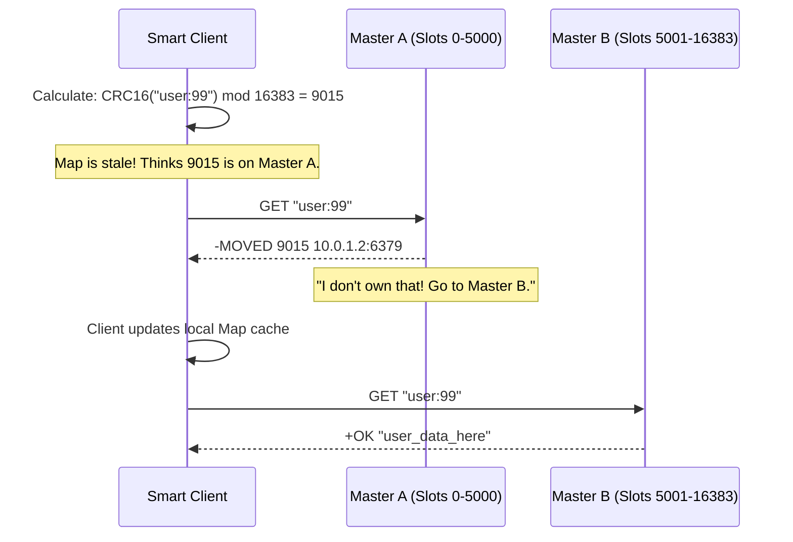
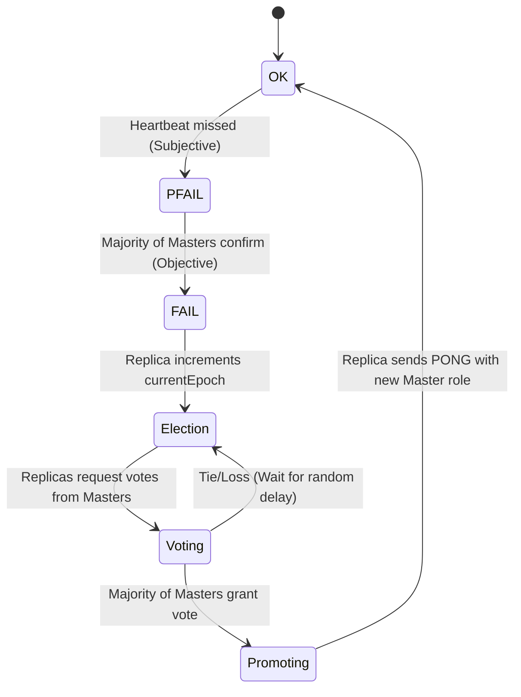

# How It Works: Sentinel & Cluster Internals

While both Sentinel and Cluster aim to keep Redis highly available, their internal mechanisms dictate entirely different network footprints and client requirements.

## 1. Redis Sentinel: Raft-like Active-Passive HA

Sentinel is a separate daemon process (`redis-sentinel`). You run it alongside your Redis nodes. Its sole purpose is monitoring and orchestrating failover.

### The Problem of Split-Brain
If you only have 2 Sentinels (Node A and Node B), and the network link between them drops, Node B thinks Node A is dead. It promotes exactly 1 replica to Master. Node A thinks Node B is dead. It keeps the original Master. You now have **Split-Brain**. Data is written to two masters simultaneously. When the network heals, you have fundamentally corrupt, diverging data. Redis replication is strictly Master->Slave; one sequence of data will be permanently wiped out during reconciliation.

### The Quorum Solution
You MUST deploy an odd number of Sentinels (3, 5, 7). 

```mermaid
stateDiagram-v2
    [*] --> NetworkIntact
    
    state NetworkIntact {
        Sent1 --> Master
        Sent2 --> Master
        Sent3 --> Master
    }
    
    NetworkIntact --> NetworkPartitioned: Cable Cut!
    
    state NetworkPartitioned {
        subgraph "Minority (1 Node)"
        Sent1 -.->|Pings Fail| Master
        note right of Sent1: PING fails.\nFlags Master as 'SDOWN' (Subjectively Down).\nRequests vote. No majority achieved.\nCannot Failover.
        end
        
        subgraph "Majority (2 Nodes)"
        Sent2 -.->|Pings Fail| Master
        Sent3 -.->|Pings Fail| Master
        note right of Sent2: PING fails.\nFlags Master as SDOWN.\nSent2 and Sent3 vote.\nAchieves QUORUM.\nFlags Master as 'ODOWN' (Objectively Down).
        end
        
        Majority --> InitiateFailover: Epoch increments
    }
```
**Failover Sequence:**
1. Sentinels agree the Master is `ODOWN`.
2. They elect a **Leader Sentinel** to perform the failover.
3. The Leader connects to the healthiest Replica, sends `REPLICAOF NO ONE` (promoting it to Master).
4. Leader contacts the remaining Replicas, sending `REPLICAOF <new_master_ip>`.
5. Leader updates its internal configuration mapping via Redis Pub/Sub so clients instantly discover the new Master.

---

## 2. Redis Cluster: Active-Active Sharding

Unlike Sentinel, Redis Cluster does not use separate daemon processes. Every Redis node itself acts as both a caching master AND a cluster monitor via the **Gossip Protocol**.

### The 16,384 Hash Slot Universe
Redis Cluster mathematically divides the entire possibility of strings into 16,384 distinct buckets (Slots). Everything relies on the formula:
`HASH_SLOT = CRC16(key) mod 16384`

```text
Cluster Layout (3 Masters):
Master A (IP: 10.0.1.1): Holds Slots 0 to 5460
Master B (IP: 10.0.1.2): Holds Slots 5461 to 10922
Master C (IP: 10.0.1.3): Holds Slots 10923 to 16383
```

### The "Smart Client" Redirection Pattern
Standard Redis clients point to a single IP. They inherently break when touching Redis Cluster. A smart Cluster client must cache the global Slot Map locally.



## 3. Data Rebalancing and ASK Redirections
When scaling up (e.g., adding Master D), you must migrate slots live without downtime. 

If Slot `9015` is currently migrating from Master B to Master D, what happens if a request comes in?
1. Client asks Master B.
2. If Master B has the specific key, it serves it.
3. If Master B doesn't have it (it was already moved to D), it returns an `-ASK` redirection.
4. Client connects to Master D, sends an `ASKING` command, then executes the `GET`. 

*Crucial difference: `-MOVED` permanently updates the client's routing table. `-ASK` is a one-time temporary detour during live migrations.*

## 4. Hash Tags (Solving the Multi-Key Limitation)
Redis intrinsically blocks multi-key transactions (`MGET`, Lua scripts) that span across multiple nodes. Why? Because cross-node atomic commits require Two-Phase Commit (2PC) networking, which is dreadfully slow.

If you have to execute Lua across `user:99:profile` and `user:99:settings`, they might naturally hash to entirely different Master nodes.

**The Fix:** You force them to the same node using **Hash Tags {}**.
If a key contains `{}` braces, Redis *only* hashes the substring inside the braces.
- Key 1: `{user:99}:profile` -> Hashed on `user:99` -> Slot 9015
- Key 2: `{user:99}:settings` -> Hashed on `user:99` -> Slot 9015

Now both keys are mathematically guaranteed to reside on the same exact physical Master node, making Lua scripts and `MGET` perfectly legal.
## 5. Metadata Propagation: The Gossip Protocol & Cluster Bus

Nodes in a Redis Cluster don't use a central coordinator (like Zookeeper). They talk to each other over a dedicated **Cluster Bus** (client port + 10,000, typically 16379).

```mermaid
graph LR
    subgraph "Gossip Bus (Binary Protocol)"
        N1[Node 1] <--> N2[Node 2]
        N2 <--> N3[Node 3]
        N3 <--> N1
        N4[Node 4] <--> N1
    end
    
    note over N1, N4: Every Ping/Pong message carries\nDigest of Slot Map + Node States.\nFull convergence reaches\nO(log N) steps.
```

## 6. Internal Failover State Machine

When a Master becomes unreachable, its Replicas initiate an election. Unlike Sentinel's raft-like leader election, Cluster uses a direct majority vote among other Masters.


