# Interview Angle: Redis Sentinel & Cluster

## Q1: "If a network partition splits a Redis Sentinel cluster in half, what prevents both sides from electing a Master and causing a Split-Brain scenario?"

### What They Are Really Testing
Do you fundamentally understand distributed systems consensus, the CAP theorem (Consistency vs Availability), and Quorum math?

### Senior Engineer Answer
"Sentinel prevents split-brain by requiring an odd number of nodes (like 3 or 5). When the network splits, one side will have the majority (e.g., 2 nodes) and the other will have a minority (e.g., 1 node). The minority side is mathematically incapable of gathering enough votes to elect a new master, so it just pauses. Only the majority side proceeds with a failover."

### Principal Architect Answer
"It uses a Raft-like consensus mechanism based on Quorum and Configuration Epochs.
If a 5-node cluster splits into a 3-node partition AND a 2-node partition.
1. The 3-node partition detects the Master is unreachable. They mark it `sdown` (subjectively down), gossip with each other, achieve quorum, and escalate to `odown` (objectively down). They increment the `Epoch` (version number) and promote a replica to Master.
2. The 2-node partition might still have the old physical Master. It continues to accept reads and writes mechanically. *This means Split-Brain is partially happening at the application level if clients are connecting to that isolated old Master.*
3. However, when the network heals, the newly promoted Master broadcasts its higher `Epoch` number. The old Master realizes a higher authoritative timeline exists, instantly demotes itself to a replica, truncates its diverging timeline, and initiates a full sync from the new Master. 
To truly prevent the old Master from accepting writes during the partition, you must configure `min-replicas-to-write 1`. If the old Master is physically cut off from its replicas during the partition, it will gracefully reject all writes, protecting the data integrity."

---

## Q2: "Redis is notoriously single-threaded. How does Redis Cluster fundamentally bypass the single-thread limit to perform 5 million reads per second?"

### What They Are Really Testing
Do you know the difference between vertical scaling (compiling a multi-threaded binary) versus horizontal mathematical sharding (Shared-Nothing architecture)?

### Senior Engineer Answer
"Redis Cluster shards the data across multiple physical computers. So instead of one thread doing 5 million reads, you have 50 computers, each running one thread, doing 100,000 reads per second."

### Principal Architect Answer
"Redis itself remains strictly single-threaded at the event-loop layer. Redis Cluster achieves horizontal scalability by mathematically decomposing the global Hash Space into 16,384 distinct `Slots` using a `CRC16(key) mod 16384` hashing algorithm. 
Because Redis utilizes a **Shared-Nothing architecture**, Master A and Master B share absolutely zero state regarding their keys. There are no global locks, no mutexes, and no cross-node thread contention. 
The complexity is fundamentally pushed to the client application (the Smart Client). The client calculates the CRC16 hash locally in its own CPU, consults its cached cluster map, and opens a direct TCP connection to the exact Master thread responsible for that slot. By stripping the routing logic out of the database and placing it in the client, 50 independent Redis instances can operate flawlessly in parallel."

---

## Whiteboard Exercise: MOVED vs ASK Redirections

**Prompt:** Draw the mechanical difference between a client interacting with a stable cluster (`-MOVED`) versus a cluster currently undergoing a live resharding/migration (`-ASK`).

```mermaid
sequenceDiagram
    participant App as Smart Client
    participant M_A as Master A (Slot 12)
    participant M_B as Master B (Slot 12 Migrating Here)
    
    rect rgb(45, 52, 54)
    note right of App: Scenario 1: Stable Cluster (Client has stale Map)
    App->>M_A: GET key (Slot 900)
    M_A-->>App: -MOVED 900 10.0.1.2:6379
    note over App: Map Updated: Slot 900 is permanently on B.
    end
    
    rect rgb(30, 39, 46)
    note right of App: Scenario 2: Live Resharding (Slot 12 is currently moving A -> B)
    App->>M_A: GET key (Slot 12)
    note over M_A: A checks its memory. The key was already transferred to B 1 second ago.
    M_A-->>App: -ASK 12 10.0.1.2:6379
    note over App: Map NOT Updated. A still owns Slot 12.
    App->>M_B: ASKING (Let me read this temporarily)
    App->>M_B: GET key (Slot 12)
    M_B-->>App: +OK "value"
    end
```

**Key talking points for the whiteboard:**
1. A `-MOVED` response means the cluster geometry has permanently changed. The client should update its internal cached map.
2. An `-ASK` response means a migration protocol is currently physically copying keys from A to B. Node A mathematically still 'owns' the slot, but the specific string the client asked for was already beamed over to B. The client must not update its map yet. Once the entire migration is complete, Node A will officially issue `-MOVED` commands for the slot. 
3. This exact distinction is why Redis Cluster can reshard and scale massively under maximum HTTP peak load without dropping a single packet or locking the database.
