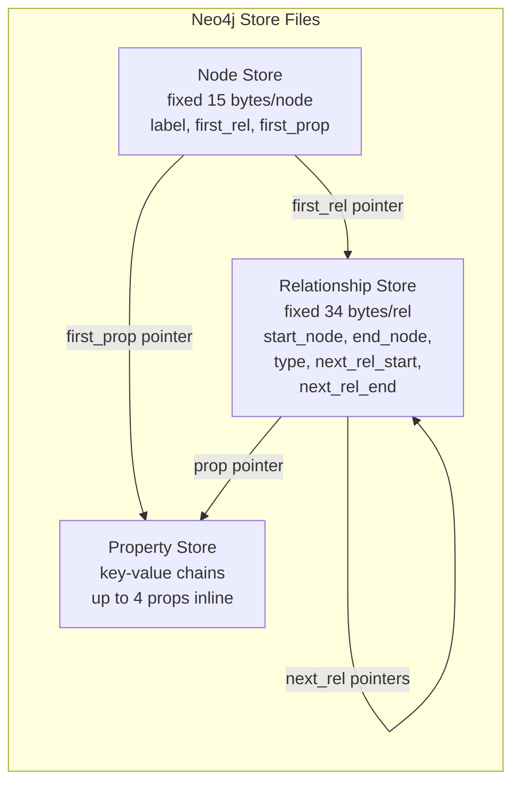

# Neo4j Internals — Concept Overview

> Native graph storage: index-free adjacency, record files, and property chains.

## Storage Architecture

**Index-free adjacency**: Each node record has a pointer to its first relationship. Each relationship has pointers to the next relationship for both start and end nodes (doubly-linked list). Traversal = following pointers. O(1) per hop.

## War Story: eBay — Neo4j for ShipmentTracking

eBay uses Neo4j to track package shipments through a graph of logistics nodes (warehouses, trucks, planes, customs). A package's path: `(:Package)-[:AT]->(:Warehouse)-[:LOADED_ON]->(:Truck)-[:ARRIVED_AT]->(:Airport)...` Querying the full journey path is a simple traversal: 2ms regardless of total graph size.

## References

| Resource | Link |
|---|---|
| [Neo4j Architecture](https://neo4j.com/docs/operations-manual/current/architecture/) | Official |
| Cross-ref: Property Graphs | [../../../01_Data_Modeling/05_Graph_Data_Modeling/01_Property_Graphs](../../../01_Data_Modeling/05_Graph_Data_Modeling/01_Property_Graphs/) |
