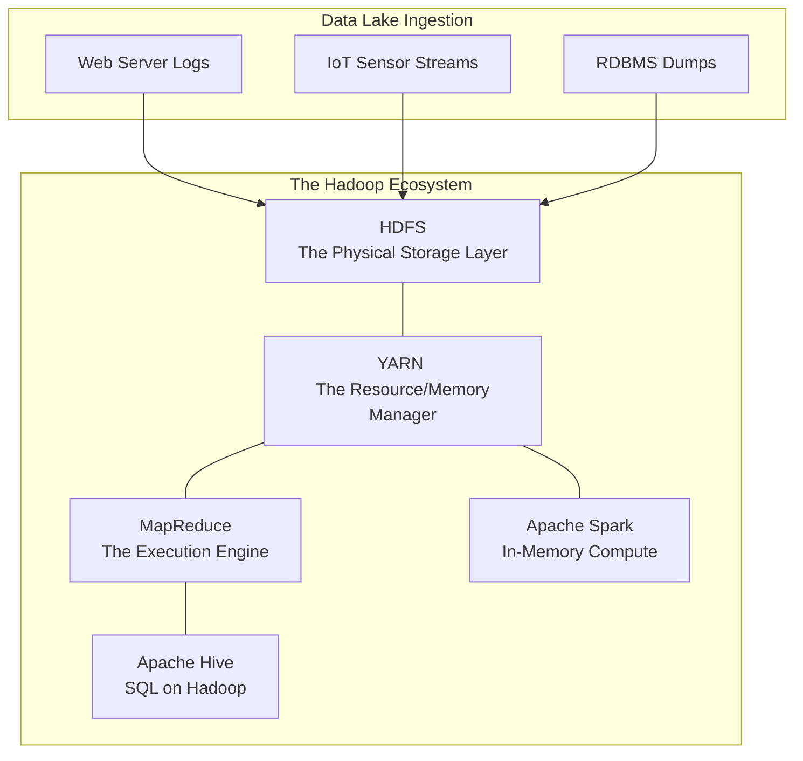

# Hadoop and HDFS — Concept Overview

## Why This Exists

In the early 2000s, Yahoo! and Google were downloading the entire Internet to build search engines. Traditional RDBMS systems (like Oracle) and traditional SAN (Storage Area Network) hardware fundamentally failed at this scale. You simply could not buy a disk large enough or fast enough to store and process petabytes of raw, unstructured web crawls. 

Google solved this by inventing the Google File System (GFS) and MapReduce. Doug Cutting and Mike Cafarella cloned these concepts into an open-source Java project named **Apache Hadoop**. 

Hadoop was a violent paradigm shift in data engineering. Instead of relying on million-dollar monolithic mainframes with specialized SANs, Hadoop explicitly assumed hardware was cheap and prone to failure. By stringing together thousands of commodity, off-the-shelf Linux servers (with raw internal hard drives), Hadoop created a single, massive, resilient file system: **HDFS (Hadoop Distributed File System)**.

---

## The Core Philosophy: Move Compute to Data

In traditional data warehousing architecture, logic dictates that data sits in a storage array (SAN) and is pulled over the network into a massive compute server (the Database Engine) for processing. 
If you try to pull 10 Petabytes of data over a network cable, the physical constraints of networking throughput (I/O) ensure the query will take weeks to complete. 

**Hadoop reversed this.**
Instead of moving data to the CPU, Hadoop moves the CPU instructions (the program) to the physical machines holding the data. 

If you have a 100 TB file distributed across 100 servers:
1.  Hadoop sends a 50 KB Java program to all 100 servers.
2.  Each server independently executes the program *only on the 1 TB of data physically sitting on its own local hard drives*.
3.  The 100 servers return only the summarized answers over the network. 
This is the essence of **MapReduce**.

---

## Where It Fits

Hadoop birthed the concept of the **Data Lake**. Unlike a Data Warehouse (which requires strictly structured rows and columns before insertion), a Data Lake accepts anything. CSVs, JSON, massive flat web logs, image binaries—you dump everything into HDFS first, and figure out how to structure and query it later ("Schema on Read").

---

## The Rise and Fall of Hadoop

Hadoop completely dominated the "Big Data" era from roughly 2008 to 2016. Entire companies (Cloudera, Hortonworks, MapR) were built explicitly to distribute and support on-premise Hadoop clusters.

**Why is it largely considered legacy today?**
Hadoop's primary constraint was that Compute and Storage were tightly coupled. If you ran out of hard drive space, you had to buy a new server that included a CPU and RAM, even if you didn't need more computing power. Furthermore, managing on-premise Hadoop clusters is notoriously difficult; Java JVM tuning, NameNode high-availability failures, and upgrading the ecosystem required armies of dedicated engineers. 

Today, the industry has universally shifted to **Cloud Object Storage (Amazon S3 / Azure Gen2)**, completely decoupling storage from compute (e.g., Snowflake, Databricks). However, massive on-premise enterprises, banks, and telecom companies still run thousands of multi-petabyte Hadoop nodes. Understanding HDFS is a prerequisite for understanding modern distributed computing.
