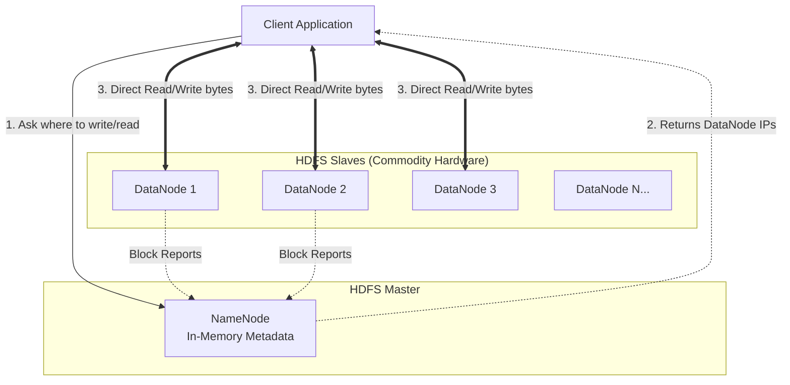

# Hadoop & HDFS — How It Works

## 1. HDFS Architecture (NameNode and DataNodes)

HDFS is a Master/Slave architecture consisting of a single massive metadata manager (NameNode) and thousands of storage workers (DataNodes).

1.  **NameNode (The Brain):** The NameNode does *not* store your actual files. It stores the metadata: the directory structure, file permissions, and explicitly a mapping of which physical DataNodes possess the broken-up pieces of your files. **Critically, the entire NameNode metadata mapping is kept in RAM.**
2.  **DataNodes (The Muscle):** These are cheap literal servers stacked with standard spinning hard drives. They physically store the actual bytes of data.

When an application wants a file, it asks the NameNode for the location. The NameNode replies with IP addresses. The client then streams the data directly from the DataNodes, removing the NameNode as a network bottleneck.

---

## 2. Block Sizes and Replication

If you upload a 1-Gigabyte `.csv` file into HDFS, it does not save it as a 1GB file on a single disk. 

### Chunking (128 MB Blocks)
HDFS splits large files into default **128 MB Blocks**. (Unlike a standard Linux filesystem block, which is 4 KB). 
A 1 GB file is sliced into roughly eight 128 MB blocks. These 8 blocks are scattered across 8 completely different DataNodes in the cluster.
*Why 128 MB?* HDFS is built for massive sequential reads. A large block size minimizes the amount of time the spinning hard drive head spends "seeking" to the correct location relative to the time spent actually streaming the data.

### Replication (3x Default)
If you deploy Hadoop on cheap hardware, drives will die daily. To prevent data loss, HDFS inherently mandates a default **Replication Factor of 3**.
When the client writes Block A to DataNode 1, DataNode 1 immediately replicates that block to DataNode 2, which replicates it to DataNode 3 (ideally on a completely physically separate rack in the data center to survive a top-of-rack switch failure). 
If DataNode 1's hard drive explodes, the NameNode detects the failed heartbeat, realizes Block A is now under-replicated (only 2 copies exist), and immediately commands DataNode 2 to forge a new 3rd copy on DataNode 4.

**The Math Cost:** Storing 1 Petabyte of raw data in HDFS physically consumes 3 Petabytes of physical hard drive space.

---

## 3. The MapReduce Paradigm

MapReduce is the original execution framework that sits on top of HDFS. It functions in two strictly isolated, disk-heavy phases.

Let's assume you want to count the occurrences of the word "Error" across 1,000 different 128-MB log files scattered across 100 servers.

### Phase 1: The MAP Phase
The central resource manager (YARN) launches a "Mapper" Java task on every single server that holds a log block. 
1. The Mapper reads its local block line-by-line.
2. Every time it sees "Error", it emits a key-value pair: `("Error", 1)`.
3. It saves these millions of intermediate `("Error", 1)` pairs back to its *local* physical hard drive.

### The Shuffle & Sort (The Network Bottleneck)
The framework now guarantees that all pairs possessing the same key are physically routed over the network to the exact same "Reducer" machine. If Machine A has 5,000 `("Error", 1)` outputs, and Machine B has 2,000 `("Error", 1)` outputs, all 7,000 records are physically copied over the network to a designated Machine C.

### Phase 2: The REDUCE Phase
Machine C receives the list: `("Error", [1,1,1,1...])`. The Reducer task simply iterates over the array, summing the values. It outputs `("Error", 7000)` and saves the final result to HDFS.

**The Crucial Flaw of MapReduce:** Because MapReduce strictly saves the intermediate output (the end of the Map phase) to physical spinning disk before performing the network Shuffle, it is extremely slow. Modern engines like **Apache Spark** were invented specifically to keep these intermediate datasets in RAM, displacing MapReduce while keeping HDFS.

---

## 4. YARN (Yet Another Resource Negotiator)

In the earliest versions of Hadoop, you could only run MapReduce jobs. 
In Hadoop 2.0, the architects decoupled the Resource Management from MapReduce, creating **YARN**.

YARN acts as the "Operating System" for the cluster. When you submit a job, you ask the YARN `ResourceManager`: *"I need 50 containers, each with 4 GB of RAM and 2 vCPUs."* 
YARN checks the NodeManagers (agents running on every server), allocates the RAM, and spins up the containers. Because YARN abstracts the cluster, you can now run Spark, Flink, HBase, and Hive natively on top of the same set of clustered hardware sharing the same HDFS disks.
