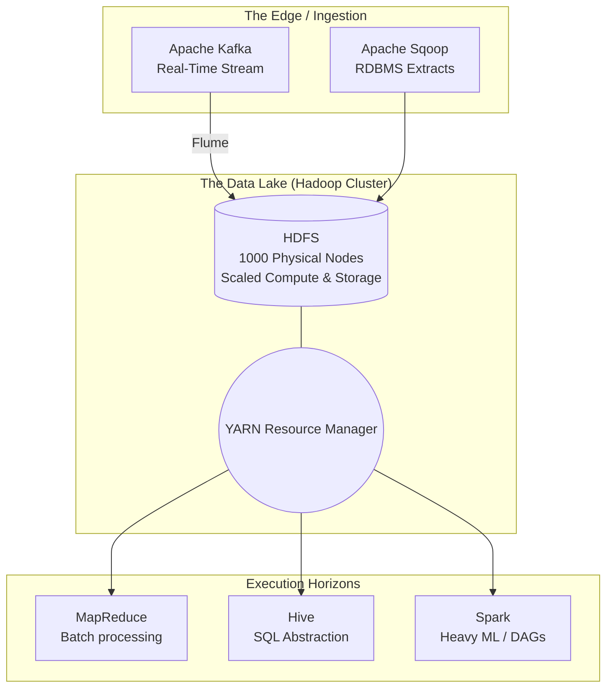

# Hadoop & HDFS — Real-World Scenarios

## Enterprise Case Studies

While most of these case studies reflect the 2010–2018 era, they represent the absolute foundation of "Big Data" engineering that modern cloud architectures evolved strictly to mimic or replace.

### 01: Yahoo!'s Search Index Generation (The Origin Story)
*   **The Scale:** In 2008, Yahoo needed to sort and process the entire scraped internet (billions of web pages) to generate inverted search indexes. Doing this sequentially on a supercomputer would take weeks. 
*   **The Architecture:** Yahoo deployed a 4,000-node Hadoop cluster. 
    *   HDFS stored the raw HTML scraped text. 
    *   MapReduce jobs were launched: Mappers tore the HTML into `(Word, Document_ID)` outputs. The Shuffle phase physically routed every instance of the word "Apple" to exactly one Reducer. The Reducer compiled the list of all URLs mentioning "Apple" and wrote the final inverted index back to HDFS.
*   **The Value:** This architecture allowed Yahoo to regenerate the global search index in roughly 16 hours, running in parallel across cheap commodity servers in their internal data centers. It proved that MapReduce was commercially viable at planetary scale.

### 02: Spotify's Music Recommendation Engine
*   **The Scale:** Spotify generated massive volumes of raw user telemetry (which song was paused, skipped, or finished) from tens of millions of active users daily.
*   **The Trap:** Storing this in an Oracle database was financially impossible, and running machine learning models over an RDBMS to find "collaborative filtering" matches cross-referenced against millions of users required full table scans that would lock the database.
*   **The Architecture:** Spotify built an enormous on-premise Hadoop cluster (over 2,000 nodes holding 60 Petabytes before their migration to GCP). 
    *   Raw Avro/Parquet clickstream logs landed sequentially in HDFS.
    *   Massive batch MapReduce (and later, Spark) jobs ran nightly. 
    *   Complex matrix multiplication math compared user profiles overnight, utilizing YARN to request 50,000 GB of temporary RAM across the cluster to hold the matrix.
*   **The Value:** The nightly execution of the "Discover Weekly" pipeline. Massive processing over unstructured data generated deeply personalized output matrices, which were then extracted from HDFS and exported into Cassandra to serve fast real-time reads globally.

### 03: Telecommunications Call Detail Records (CDRs)
*   **The Scale:** A telecom carrier generates a "CDR" event exactly every time a customer makes a call, sends an SMS, or uses a byte of 5G data. This results in billions of tiny flat-file records landing in the data center every single day.
*   **The Trap:** Legal compliance dictates that telecommunications companies must store these records queryable for 7 years for law enforcement purposes. 7 years of daily billions-of-rows completely breaks traditional SAN storage.
*   **The Architecture:** The Telecom established an expanding "Data Lake" on HDFS.
    *   They bought cheap $2U$ rack servers stacked with 24 Terabytes of heavy, slow spinning hard drives, adding 10 a month logically into the HDFS massive storage pool.
    *   Using **Apache Impala / Hive**, billing analysts and compliance officers could query a 5-year-old phone number directly. The query might take 45 minutes to execute via MapReduce, but the alternative was tape-storage retrieval taking weeks.
*   **The Value:** Infinite storage retention on low-cost hardware. The "Schema on Read" paradigm meant they didn't have to define complex relational structures before ingesting the raw network binary data into HDFS.

---

## The Legacy Architecture Topology

*Note: In modern cloud data lakes (S3/Snowflake), the HDFS nodes representing localized CPU+Disk are physically separated, destroying Data Locality but achieving absolute financial efficiency.*
