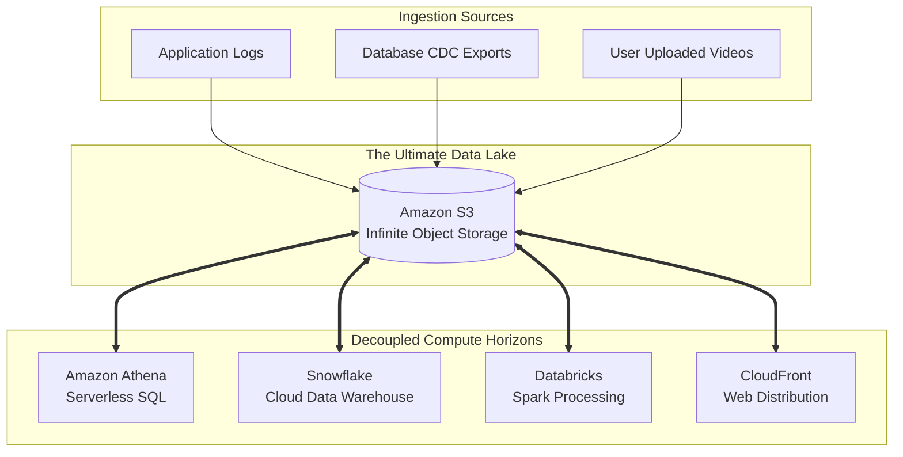

# Amazon S3 & Cloud Storage — Concept Overview

## Why This Exists

For decades, storage architectures were strictly bound to two physical paradigms:
1.  **Block Storage (SAN/EBS):** You attach a raw physical hard drive to an operating system. Highly performant for databases, but extremely expensive and physically limited to a single machine/volume size.
2.  **File Storage (NAS/NFS):** You mount a shared network drive with a strict hierarchical directory tree (`/var/www/images/...`). Great for local networks, but directory tree traversal becomes hopelessly slow when scaling to billions of files across the internet.

When Amazon Web Services launched in 2006, they recognized that the internet required a fundamentally new storage architecture: **Object Storage**. 

**Amazon S3 (Simple Storage Service)** was born. It was not a physical hard drive you mount to a server. It was an HTTP API. You send a `PUT` request with a file and a unique string (a Key), and Amazon physically stores those bytes across thousands of servers invisibly. When you want the file back, you send a `GET` request using that exact Key.

---

## The Core Philosophy: Decoupling Storage from Compute

In the Hadoop (HDFS) era, to get more storage space, you had to buy a physical server that included a CPU and RAM. Storage and Compute were physically merged ("Coupled"). 

Amazon S3 triggered the modern Data Lake revolution by enforcing **absolute decoupling**. 
- You can store 50 Petabytes of raw data in S3 for pennies per gigabyte without purchasing a single CPU. 
- When you want to run an analytical query against that data, you deploy a temporary cluster of 1,000 servers (Compute) using Databricks or Snowflake. 
- The Compute cluster spins up, pulls the required data from S3 over Amazon's massive internal 100-Gbps network, runs the math, saves the answer back to S3, and shuts down after exactly 3 hours. 
- You only pay for 3 hours of Compute, while the massive data rests securely in cheap S3 storage forever.

---

## What Actually is "Object" Storage?

In standard File Storage (like your laptop), a file is saved in folders. If you move a file from `/documents` to `/photos`, the operating system has to update a complex, localized index tree. 

**Object Storage has no folders.**
S3 operates on a massive, mathematically flat namespace. 

When you upload a file to S3 like `s3://my-bucket/2023/images/cat.jpg`, S3 does **not** create a folder called `2023`, or a subfolder called `images`. 
S3 simply stores a flat object where the literal name of the file is the entire 22-character string: `"2023/images/cat.jpg"`. The slashes are purely cosmetic text.

This flat architecture is the secret to scaling infinitely. Because there is no central directory tree to traverse, S3 can instantly route a `GET` request to the exact physical hard drive holding the object using massive, distributed hash tables.

---

## Where It Fits

S3 has become the ultimate "Data Lake" gravity well. Almost every major modern data architecture assumes all data eventually lands in an Object Store.

