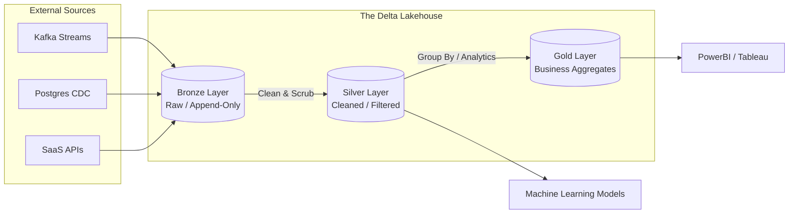

# Databricks Delta Lake — Concept Overview

## Why This Exists

To understand Delta Lake, you have to understand the two massive paradigm shifts that preceded it.

1.  **The Data Warehouse (1990s - 2010s):** Systems like Oracle Exadata and Teradata. They offered strict ACID transactions, perfect reliability, and fast SQL queries. *The Flaw:* They required structured rows and columns (Schema on Write) and coupled expensive storage with expensive compute. Scaling to accommodate unstructured data or Petabytes of logs was financially ruinous.
2.  **The Data Lake (2010s - 2018):** Systems like Hadoop HDFS and Amazon S3. They offered infinite, cheap storage for dirty, unstructured logs and ML blobs. *The Flaw:* They had zero transactional reliability. If a Spark job crashed while writing a massive Parquet file, it left corrupted half-written files in S3. There was no `UPDATE` or `DELETE` command. If you needed to fix a bad row, you had to rewrite an entire 5 Gigabyte file from scratch. Data Lakes rapidly degraded into unqueryable "Data Swamps".

**The Lakehouse Paradigm:**
In roughly 2019, Databricks (the creators of Apache Spark) pioneered "The Lakehouse". 
A Lakehouse attempts to combine the best of both worlds: It provides the **strict ACID transactional reliability and SQL performance of a Data Warehouse**, while operating directly on the **cheap, infinitely scalable object storage of a Data Lake (Amazon S3/Azure Gen2)**.

The technology that makes this magic possible is **Delta Lake**.

---

## What is Delta Lake?

Delta Lake is an open-source storage layer that sits squarely on top of your existing S3 Data Lake. 
It is not a database engine. It is not a live server. 
It is, at its core, simply an insanely clever file protocol format leveraging standard open-source **Apache Parquet** files alongside a strictly managed JSON **Transaction Log**.

By forcing all Apache Spark (or Presto/Athena) readers and writers to consult the Transaction Log before touching the Parquet files, Delta Lake magically brings database features to raw S3 storage:
- **ACID Transactions:** Multiple Spark clusters can write to the same S3 directory simultaneously without corrupting the data or seeing half-written files.
- **Upserts and Deletes:** You can run `UPDATE users SET name='Alice' WHERE id=1` natively against an S3 bucket.
- **Time Travel:** Because Delta never deletes old files immediately, you can query exactly what the table looked like last Tuesday.

---

## The Medallion Architecture

Databricks heavily advocates for organizing a Delta Lakehouse using the "Medallion" data flow logic. This is the modern replacement for traditional ETL (Extract, Transform, Load) pipelines.

- **Bronze (Raw):** Every event is dumped here exactly as it arrives. Append-only. If the data is dirty or corrupt, it doesn't matter. You never mutate the Bronze layer; it is your ultimate rollback truth.
- **Silver (Validated):** A Spark pipeline reads Bronze, removes duplicates, filters out null values, enforces strict schemas, and uses Delta `MERGE` to update records. This is querying ready for Data Scientists.
- **Gold (Aggregated):** Heavy SQL aggregations (`SUM(sales) BY region`). This layer is optimized specifically for fast reads by Tableau or PowerBI dashboards.
